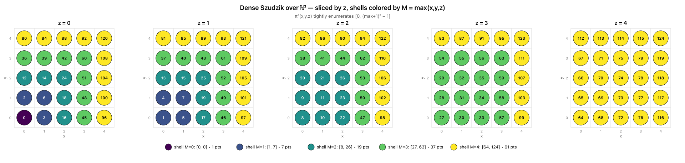
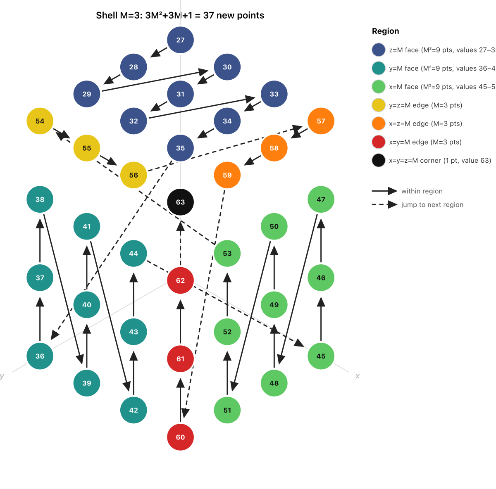

# Generalizing the Szudzik Pairing Function to $d$ Dimensions



The image above visualizes `dense_3d(x, y, z)` as a color-mapped point cloud, sliced into shells by value. The rest of this post derives it.

## 1. The 2D Szudzik Pairing Function

The Szudzik pairing function is a bijection $f : \mathbb{N}^2 \to \mathbb{N}$ defined by:

$$
f(x, y) = \begin{cases} y^2 + x & \text{if } y > x \\ x^2 + x + y & \text{if } x \geq y \end{cases}
$$

To understand why this works, define the **shell** of a point as:

> **Definition.** For $M \in \mathbb{N}$, the $M$-shell in $\mathbb{N}^2$ is:
> $$S_M = \{(x, y) \in \mathbb{N}^2 : \max(x, y) = M\}$$

The shells partition $\mathbb{N}^2$ — every point belongs to exactly one shell. Shell $M$ contains exactly $(M+1)^2 - M^2 = 2M+1$ points.

Szudzik enumerates the shells in order $M = 0, 1, 2, \ldots$ and within each shell assigns consecutive values starting from $M^2$:

- **$y = M$ face** ($y = M,\ x < M$): values $M^2, \ldots, M^2+M-1$ — $M$ points
- **$x = M$ face** ($x = M,\ y \leq M$): values $M^2+M, \ldots, M^2+2M$ — $M+1$ points

Since $M + (M+1) = 2M+1$, this exactly covers $[M^2,\ (M+1)^2 - 1]$, and because the shells cover disjoint ranges, $f$ is a bijection.

---

## 2. Extending to 3D

The same shell idea applies in three dimensions. Define:

$$S_M = \{(x, y, z) \in \mathbb{N}^3 : \max(x, y, z) = M\}$$

Shell $M$ now contains $(M+1)^3 - M^3 = 3M^2 + 3M + 1$ points.

Within shell $M$, each point belongs to exactly one **face type**, determined by which coordinates equal $M$:

| Face type       | Condition              | Count   |
|-----------------|------------------------|---------|
| $z = M$ face    | $x < M,\ y < M,\ z = M$ | $M^2$ |
| $y = M$ face    | $x < M,\ y = M,\ z < M$ | $M^2$ |
| $x = M$ face    | $x = M,\ y < M,\ z < M$ | $M^2$ |
| $y = z = M$ edge | $x < M,\ y = M,\ z = M$ | $M$  |
| $x = z = M$ edge | $x = M,\ y < M,\ z = M$ | $M$  |
| $x = y = M$ edge | $x = M,\ y = M,\ z < M$ | $M$  |
| corner          | $x = M,\ y = M,\ z = M$ | $1$   |
| **Total**       |                          | $3M^2+3M+1$ |

The diagram below ($M = 3$ shell) illustrates these face types:



Solid arrows show enumeration within a face type; dashed arrows show the jump to the next face type. Within each face the two free coordinates are enumerated in row-major order (outer coordinate first).

The resulting formula for $(x, y, z)$ with $M = \max(x,y,z)$ and $\text{base} = M^3$:

$$
\text{dense}_3(x,y,z) = M^3 + \begin{cases}
M \cdot x + y                & x < M,\ y < M \quad (z = M \text{ face})\\
M^2 + M \cdot x + z          & x < M,\ z < M \quad (y = M \text{ face})\\
2M^2 + M \cdot y + z         & y < M,\ z < M \quad (x = M \text{ face})\\
3M^2 + x                     & x < M           \quad (y=z=M \text{ edge})\\
3M^2 + M + y                 & y < M           \quad (x=z=M \text{ edge})\\
3M^2 + 2M + z                & z < M           \quad (x=y=M \text{ edge})\\
3M^2 + 3M                    &                 \quad (\text{corner})
\end{cases}
$$

---

## 3. The General $d$-Dimensional Bijection

### Setup

For a point $\mathbf{p} = (p_1, \ldots, p_d) \in \mathbb{N}^d$, let $M = \max_i p_i$. The **fixed set** of $\mathbf{p}$ is:

$$T = \{i \in \{1,\ldots,d\} : p_i = M\}$$

the coordinate indices pinned at $M$. The free coordinates are the remaining $d - |T|$ values $(p_i)_{i \notin T}$, listed in index order as $(f_0, \ldots, f_{d-|T|-1})$.

### Definition

For any non-empty subset $T \subseteq \{1,\ldots,d\}$, let $\text{rank}(T)$ be the 0-based position of $T$ among subsets of the same size $|T|$, ordered reverse-lexicographically. Define:

$$\text{face\_start}(T) = \sum_{k=1}^{|T|-1} \binom{d}{k} M^{d-k} \;+\; \text{rank}(T) \cdot M^{d-|T|}$$

For a point $\mathbf{p}$ with fixed set $T$ and free coordinates $(f_0, \ldots, f_{d-|T|-1})$, define:

$$\text{offset}(\mathbf{p}) = \sum_{j=0}^{d-|T|-1} f_j \cdot M^{d-|T|-1-j}$$

### Theorem

The function $\text{dense}_d : \mathbb{N}^d \to \mathbb{N}$ defined by:

$$\boxed{\text{dense}_d(\mathbf{p}) = M^d + \text{face\_start}(T) + \text{offset}(\mathbf{p})}$$

is a **bijection**.

### Proof

**Step 1: Shell decomposition.**

The shells $\{S_M : M \geq 0\}$ partition $\mathbb{N}^d$, so it suffices to show that for each $M$, $\text{dense}_d$ restricts to a bijection $S_M \to [M^d,\ (M+1)^d - 1]$.

**Step 2: Face decomposition.**

The face types $\{F_T : T \subseteq \{1,\ldots,d\},\ T \neq \emptyset\}$ partition $S_M$, where:

$$F_T = \{\mathbf{p} \in S_M : \{i : p_i = M\} = T\}$$

Each face $F_T$ is in bijection with $\{0,\ldots,M-1\}^{d-|T|}$ via the free coordinates, so $|F_T| = M^{d-|T|}$.

**Step 3: Total count via the Binomial Theorem.**

Summing over all non-empty $T$:

$$|S_M| = \sum_{k=1}^{d} \binom{d}{k} M^{d-k} = (M+1)^d - M^d$$

where the last equality is the Binomial Theorem with the $k=0$ term ($M^d$) moved to the left. So the faces exactly tile $[M^d,\ (M+1)^d - 1]$ with no gaps:

$$M^d + \binom{d}{1}M^{d-1} + \binom{d}{2}M^{d-2} + \cdots + 1 = (M+1)^d \checkmark$$

**Step 4: Injectivity within a face.**

For a fixed face type $T$, $\text{face\_start}(T)$ is constant, so two points in $F_T$ receive the same value iff they have the same offset, iff they have the same free coordinates, iff they are the same point. $\checkmark$

**Step 5: Injectivity across faces.**

Two points in different faces $F_T,\ F_{T'}$ (within the same shell $M$) receive values in non-overlapping integer ranges by construction of $\text{face\_start}$. $\checkmark$

**Step 6: Injectivity across shells.**

Shell $M$ maps to $[M^d,\ (M+1)^d - 1]$ and shell $M' \neq M$ maps to a disjoint range. $\checkmark$

**Surjectivity:** every $n \in \mathbb{N}$ lies in exactly one interval $[M^d,\ (M+1)^d - 1]$ and is hit by the unique point with that shell, face, and offset. $\checkmark$

Therefore $\text{dense}_d$ is a bijection. $\square$

---

## 4. Explicit Formulas

### Forward: $\text{dense}_d(\mathbf{p})$

Let $\mathbf{p} = (p_1, \ldots, p_d) \in \mathbb{N}^d$. Define:

$$M = \max(p_1, \ldots, p_d), \qquad T = \{i : p_i = M\}, \qquad K = |T|$$

Let $(f_0, \ldots, f_{d-K-1})$ be the free coordinates ($p_i$ for $i \notin T$, in index order). Then:

$$\text{face\_start}(T) = \sum_{k=1}^{K-1} \binom{d}{k} M^{d-k} \;+\; \text{rank}(T) \cdot M^{d-K}$$

$$\text{offset}(\mathbf{p}) = \sum_{j=0}^{d-K-1} f_j \cdot M^{d-K-1-j}$$

$$\boxed{\text{dense}_d(\mathbf{p}) = M^d + \text{face\_start}(T) + \text{offset}(\mathbf{p})}$$

**Special cases:**
- $K = d$ (corner): $\text{face\_start} = \sum_{k=1}^{d-1}\binom{d}{k}M^{d-k} = (M+1)^d - M^d - 1$, $\text{offset} = 0$
- $K = 1$ (first face): $\text{face\_start} = 0$; $\text{offset} = \text{row-major index of the } (d-1) \text{ free coordinates}$

---

### Reverse: $\text{dense}_d^{-1}(v)$

Given $v \in \mathbb{N}$, recover $\mathbf{p} \in \mathbb{N}^d$:

**Step 1 — Shell:**

$$M = \lfloor v^{1/d} \rfloor, \qquad \text{rem} = v - M^d$$

(Correct for floating-point drift: increment $M$ while $(M+1)^d \leq v$.)

**Step 2 — Face type:**

Walk face types $T_1, T_2, \ldots$ in forward-map order. Find $j$ such that:

$$\sum_{i < j} M^{d-|T_i|} \;\leq\; \text{rem} \;<\; \sum_{i \leq j} M^{d-|T_i|}$$

then set $\text{rem}' = \text{rem} - \sum_{i < j} M^{d-|T_i|}$.

**Step 3 — Free coordinates** ($K = |T_j|$):

$$f_\ell = \left\lfloor \frac{\text{rem}'}{M^{d-K-1-\ell}} \right\rfloor \bmod M \qquad \text{for } \ell = 0, \ldots, d-K-1$$

**Step 4 — Reconstruct:**

$$p_i = \begin{cases} M & i \in T_j \\ f_\ell & \ell = \text{rank of } i \text{ among } \{1,\ldots,d\} \setminus T_j \end{cases}$$

---

## 5. Python Implementations

### General $d$-dimensional forward

```python
from itertools import combinations
from math import comb

def dense_nd(p):
    d, M = len(p), max(p)
    if M == 0: return 0

    mask = frozenset(i for i, x in enumerate(p) if x == M)
    free = [p[i] for i in range(d) if i not in mask]
    K    = len(mask)

    # face_start: complete earlier size-groups + rank within current group
    face_start = sum(comb(d, k) * M**(d - k) for k in range(1, K))
    for rank, T in enumerate(sorted(combinations(range(d), K), reverse=True)):
        if frozenset(T) == mask:
            face_start += rank * M**(d - K)
            break

    # row-major offset of free coordinates
    offset = 0
    for f in free:
        offset = offset * M + f

    return M**d + face_start + offset
```

### General $d$-dimensional reverse

```python
def inverse_nd(v, d):
    if v == 0: return (0,) * d

    # Step 1: integer d-th root
    M = int(round(v ** (1 / d)))
    while (M + 1)**d <= v: M += 1
    while M**d > v:        M -= 1
    rem = v - M**d

    # Step 2: walk face types to find T
    for K in range(1, d + 1):
        for T in sorted(combinations(range(d), K), reverse=True):
            face_size = M**(d - K)          # = 1 when K == d
            if rem < face_size:
                # Step 3: decode rem as (d-K)-digit base-M number
                free_vals = []
                for _ in range(d - K):
                    free_vals.append(rem % M)
                    rem //= M
                free_vals.reverse()

                # Step 4: reconstruct point
                fixed, result, fi = set(T), [], 0
                for i in range(d):
                    if i in fixed: result.append(M)
                    else:          result.append(free_vals[fi]); fi += 1
                return tuple(result)
            rem -= face_size
```

---

### Unrolled 3D forward

```python
def dense_3d(x, y, z):
    M = max(x, y, z)
    if M == 0: return 0
    base = M * M * M
    if x < M and y < M: return base +           M * x + y   # z=M face
    if x < M and z < M: return base +     M*M + M * x + z   # y=M face
    if y < M and z < M: return base + 2 * M*M + M * y + z   # x=M face
    if x < M:           return base + 3 * M*M + x            # y=z=M edge
    if y < M:           return base + 3 * M*M + M + y        # x=z=M edge
    if z < M:           return base + 3 * M*M + 2*M + z      # x=y=M edge
    return                     base + 3 * M*M + 3*M           # corner
```

### Unrolled 3D reverse

```python
def inverse_3d(v):
    if v == 0: return (0, 0, 0)

    # integer cube root
    M = int(round(v ** (1/3)))
    while (M + 1)**3 <= v: M += 1
    while M**3 > v:        M -= 1
    rem = v - M * M * M

    if rem < M*M:  return (rem // M, rem % M, M)   # z=M face
    rem -= M*M
    if rem < M*M:  return (rem // M, M, rem % M)   # y=M face
    rem -= M*M
    if rem < M*M:  return (M, rem // M, rem % M)   # x=M face
    rem -= M*M
    if rem < M:    return (rem, M, M)               # y=z=M edge
    rem -= M
    if rem < M:    return (M, rem, M)               # x=z=M edge
    rem -= M
    if rem < M:    return (M, M, rem)               # x=y=M edge
    return                (M, M, M)                 # corner
```

---

## 6. Summary

| $d$ | Shell size | Coefficients |
|-----|------------|--------------|
| $2$ | $2M + 1$ | $2,\ 1$ |
| $3$ | $3M^2 + 3M + 1$ | $3,\ 3,\ 1$ |
| $4$ | $4M^3 + 6M^2 + 4M + 1$ | $4,\ 6,\ 4,\ 1$ |
| $d$ | $(M+1)^d - M^d$ | $\binom{d}{1},\ \ldots,\ \binom{d}{d}$ |

The coefficients are row $d$ of Pascal's triangle (excluding the leading $\binom{d}{0}M^d$ term, which accounts for the interior). This is the Binomial Theorem, and it is the heart of the proof.
